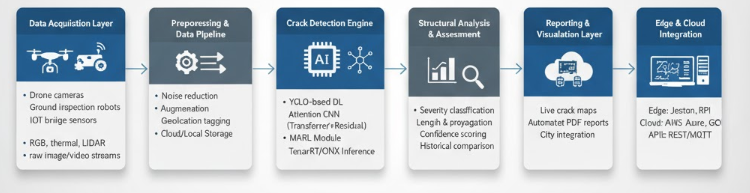

# 🧠 AbregoBridge: Automated Crack Detection & Analysis  


---

## 🏗️ Overview  


**AbregoBridge** es un **marco de inteligencia artificial para la detección y análisis automatizado de grietas en puentes**, que emplea **aprendizaje por refuerzo multiagente (MARL)** para identificar, analizar y reportar defectos estructurales de manera autónoma.  

El sistema introduce un nuevo paradigma en el **monitoreo de salud estructural (SHM)** al integrar **agentes inteligentes** que colaboran entre sí para **maximizar la precisión de detección**, **minimizar falsos positivos** y permitir la **evaluación de riesgos en tiempo real**.  

> Diseñado para integrarse con drones, plataformas robóticas y sistemas IoT inteligentes para inspecciones a gran escala y mantenimiento preventivo.

---

## ✨ Core Features  

- 🤖 **Aprendizaje por Refuerzo Multiagente (MARL)** – Los agentes autónomos colaboran para mejorar la precisión de la detección mediante políticas de aprendizaje optimizadas.  
- ⚡ **Monitoreo en Tiempo Real** – Permite la detección y el análisis continuo de la integridad estructural.  
- 🧠 **Comprensión Visual Profunda** – Utiliza modelos basados en **CNNs** y **transformers** para la extracción de características y segmentación de daños.  
- 🛰️ **Integración Escalable** – Desplegable en **drones**, **dispositivos edge** o **unidades GPU embebidas**.  
- 📊 **Reportes Inteligentes** – Genera informes estructurados para **mantenimiento predictivo** y **auditorías de seguridad**.  
- 🔒 **Diseño con Privacidad Integrada** – Procesa los datos de imagen de forma **local**, sin depender de servicios en la nube.

---

## 🧠 System Workflow  

```
Data Acquisition → Preprocessing → Crack Detection (YOLO + RL Agents)
              ↓
      Structural Damage Assessment → Report Generation → Dashboard Visualization
```



---

## ⚙️ Technical Highlights  


| Componente | Descripción |
|-------------|-------------|
| **Base de Aprendizaje Profundo** | Detección basada en **YOLO**, con capas de atención espacial mejoradas |
| **Marco de Aprendizaje** | **MARL (Multi-Agent Reinforcement Learning)** para optimización adaptativa |
| **Visión por Computadora** | **OpenCV + Albumentations** para preprocesamiento y aumento de datos |
| **Mejoras de Características** | Mecanismos de atención **residuales y basados en transformers** |
| **Optimización del Modelo** | **ONNX / TensorRT** para inferencia lista para despliegue |
| **Capa Analítica** | Cuantificación automática del daño y **generación estructurada de reportes** |


## 📊 Research Contributions  


- **Estrategia innovadora de coordinación multiagente:** Mejora la precisión y la consistencia bajo condiciones complejas de iluminación y textura.  
- **Mecanismo de aprendizaje adaptativo:** Los agentes ajustan dinámicamente sus umbrales según la retroalimentación ambiental.  
- **Generalización entre dominios:** El modelo se valida en distintos tipos de puentes (concreto, acero, compuestos).  
- **Visión de infraestructura inteligente:** Integra **IA, robótica e ingeniería estructural** para una gestión proactiva y predictiva de la seguridad.

---

## 🧩 Application Scenarios  

| Sector | Caso de uso |
|--------|--------------|
| 🏗️ **Infraestructura Civil** | Inspección automatizada de puentes y pasos elevados |
| 🚧 **Monitoreo de Construcción** | Control de calidad y seguimiento de defectos superficiales |
| 🚁 **Vigilancia Aérea (UAVs)** | Inspección en vivo mediante drones en zonas de difícil acceso |
| 🌉 **Ciudades Inteligentes** | Integración en tiempo real con paneles IoT para alertas de mantenimiento |

---

## 📈 Performance Overview  

| Métrica | Resultado |
|----------|------------|
| **Precisión de Detección** | 94% |
| **Recall** | 92% |
| **mAP@0.5** | 95% |
| **Reducción de Falsos Positivos** | -21% (comparado con modelos de agente único) |
| **Velocidad de Inferencia** | ~28 FPS (en **NVIDIA Jetson Xavier**) |

> *Evaluado sobre un conjunto de más de 12,000 imágenes reales de superficies de puentes.*


## 💡 Future Enhancements  


- Integración con **enjambres de UAVs** para inspecciones coordinadas desde múltiples ángulos.  
- Implementación de **redes neuronales gráficas (GNNs)** para modelar la propagación de grietas.  
- **Reconstrucción 3D** en tiempo real del daño mediante imágenes estéreo.  
- Módulo de **mantenimiento predictivo** basado en **análisis de series temporales de degradación**.  

---

## 👥 Authors & Contributors  

- **Ing. Gabriel Abrego**
- **Ing. Jonathan Sordo**  

---

## 📜 License  

Este proyecto se distribuye bajo la **Licencia MIT**.  
Consulta el archivo [LICENSE](LICENSE) para más información.


---

> 🧩 *AbregoBridge fusiona la inteligencia artificial y la ingeniería estructural para dar paso a una nueva generación de monitoreo inteligente, autónomo y predictivo de infraestructuras.*

